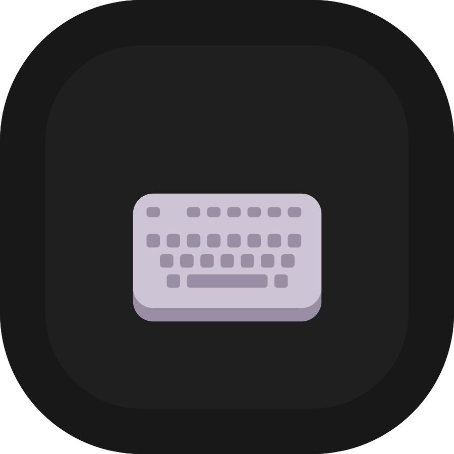

	<h1>Keybinded</h1>

	

 

    
    
    

	

### Keybinded is a simple keybinding based on the ALT key. It take inspiration of some keybindings from vim and helix.

### If you have suggestions, fell free to report it [here](https://github.com/Gael-Lopes-Da-Silva/KeybindedVSCode/issues/new/choose). This would help me a lot.

## Keybinding
|   Keybinding    | Description                                  |
| :-------------: | :------------------------------------------- |
|      alt+j      | cursorDown                                   |
|      alt+k      | cursorUp                                     |
|      alt+h      | cursorLeft                                   |
|      alt+l      | cursorRight                                  |
|   alt+shift+j   | cursorDownSelect                             |
|   alt+shift+k   | cursorUpSelect                               |
|   alt+shift+h   | cursorLeftSelect                             |
|   alt+shift+l   | cursorRightSelect                            |
|      alt+j      | workbench.action.quickOpenSelectNext         |
|      alt+k      | workbench.action.quickOpenSelectPrevious     |
|      alt+j      | selectNextSuggestion                         |
|      alt+k      | selectPrevSuggestion                         |
|      alt+j      | list.focusDown                               |
|      alt+k      | list.focusUp                                 |
|      alt+j      | selectNextCodeAction                         |
|      alt+k      | selectPrevCodeAction                         |
|      alt+j      | showNextParameterHint                        |
|      alt+k      | showPrevParameterHint                        |
|      alt+l      | explorer.openAndPassFocus                    |
|      alt+l      | list.select                                  |
|      alt+l      | list.stickyScrollselect                      |
|      alt+l      | acceptSelectedCodeAction                     |
|      alt+l      | acceptSelectedSuggestion                     |
|      alt+b      | cursorWordLeft                               |
|      alt+f      | actions.find                                 |
|      alt+d      | deleteRight                                  |
|   alt+shift+d   | deleteInsideWord                             |
|      alt+w      | cursorWordRight                              |
|   alt+shift+b   | cursorWordLeftSelect                         |
|   alt+shift+w   | cursorWordRightSelect                        |
|      alt+a      | workbench.action.toggleSidebarVisibility     |
|      alt+s      | editor.action.addSelectionToNextFindMatch    |
|   alt+shift+f   | editor.action.triggerParameterHints          |
|      alt+x      | expandLineSelection                          |
|      alt+n      | workbench.action.terminal.toggleTerminal     |
|      alt+p      | editor.action.clipboardPasteAction           |
|      alt+y      | editor.action.clipboardCopyAction            |
|      alt+i      | workbench.action.quickOpen                   |
|      alt+/      | editor.action.commentLine                    |
|      alt+'      | editor.action.triggerSuggest                 |
|      alt+'      | toggleSuggestionDetails                      |
|      alt+u      | undo                                         |
|      alt+e      | cursorPageUp                                 |
|      alt+q      | cursorPageDown                               |
|   alt+shift+u   | redo                                         |
|   alt+g alt+f   | editor.action.showDefinitionPreviewHover     |
|   alt+g alt+e   | workbench.view.explorer                      |
|   alt+g alt+t   | workbench.view.scm                           |
|   alt+g alt+b   | workbench.action.toggleActivityBarVisibility |
|   alt+g alt+z   | workbench.action.toggleZenMode               |
|   alt+g alt+l   | cursorEnd                                    |
|   alt+g alt+h   | cursorHome                                   |
|   alt+g alt+k   | cursorTop                                    |
|   alt+g alt+j   | cursorBottom                                 |
|   alt+g alt+g   | workbench.action.gotoLine                    |
|     alt+\\      | editor.action.jumpToBracket                  |
|    alt+enter    | editor.action.insertLineAfter                |
| alt+shift+enter | editor.action.insertLineBefore               |
|  alt+backspace  | editor.action.deleteLines                    |
|      alt+c      | editor.action.insertCursorBelow              |
|   alt+shift+c   | editor.action.insertCursorAbove              |
|      alt+o      | editor.action.insertLineAfter                |
|   alt+shift+o   | editor.action.insertLineBefore               |

## How to build ?
If you want a build of Yellowed you can find it in the release section or in the [build](./build/) folder. Else use `vsce package` in the project folder.

## How to install ?
To install, open visual studio code and go to the extention menu. Click on the three dots and click on `Install from VSIX` and choose the `keybinded-X.X.X.vsix` file. Or just install it on the market place.